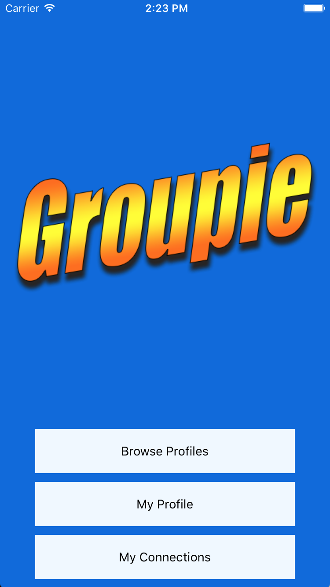

# Groupie

## Groupie is an app for musicians to help find other local musicians to collaborate or start a band with with an easy Tinder™ style interface.  Built in React Native with a Node.js backend.

###
Client:

https://github.com/TylerBriskie/groupieCLIENT

Server:

https://github.com/TylerBriskie/groupie-server

## Screenshots

