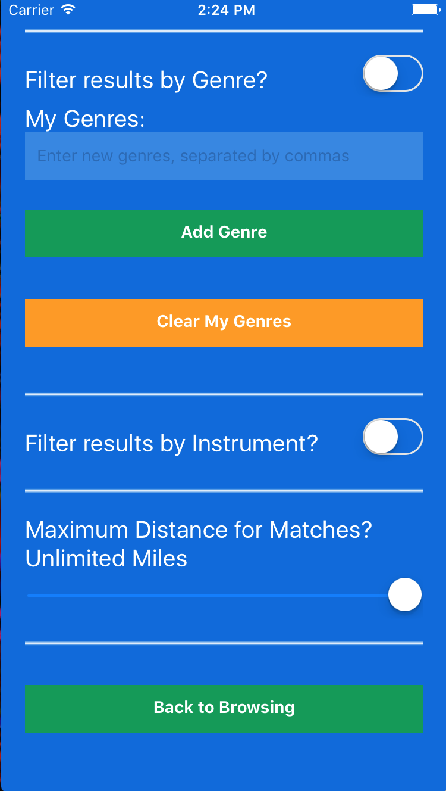

# Groupie

###
Client:

https://github.com/TylerBriskie/groupieCLIENT

Server:

https://github.com/TylerBriskie/groupie-server

## Summary

### Groupie is an app for musicians to help find other local musicians to collaborate or start a band with with an easy Tinder™ style interface.  Built in React Native with a Node.js backend.

### Sign up for a free profile, pick your instrument, and you'll be redirected to your edit profile page.  You'll want to paste a link to the Youtube video / Soundcloud audio file you want to share in the Content URL input.  Add genres that you're interested in, and pick your sorting options.  You can sort by Genre, Instrument, or Distance from you.   

## Screenshots

### Sign In

### Browsing Other Musicians

### Editing Profile and Sorting Options

